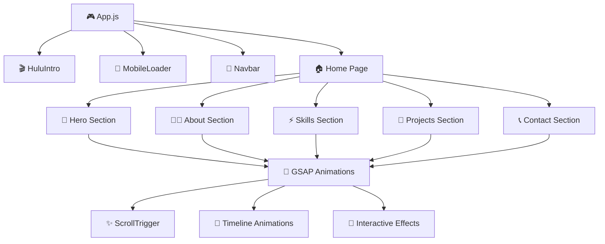

# 🎮 **PERSONAL WEBSITE - PORTFOLIO 2.0** 🚀

<div align="center">

```ascii
██████╗  ██████╗ ██████╗ ████████╗███████╗ ██████╗ ██╗     ██╗ ██████╗     ██████╗    ██████╗ 
██╔══██╗██╔═══██╗██╔══██╗╚══██╔══╝██╔════╝██╔═══██╗██║     ██║██╔═══██╗    ╚════██╗  ██╔═████╗
██████╔╝██║   ██║██████╔╝   ██║   █████╗  ██║   ██║██║     ██║██║   ██║     █████╔╝  ██║██╔██║
██╔═══╝ ██║   ██║██╔══██╗   ██║   ██╔══╝  ██║   ██║██║     ██║██║   ██║    ██╔═══╝   ████╔╝██║
██║     ╚██████╔╝██║  ██║   ██║   ██║     ╚██████╔╝███████╗██║╚██████╔╝    ███████╗  ╚██████╔╝
╚═╝      ╚═════╝ ╚═╝  ╚═╝   ╚═╝   ╚═╝      ╚═════╝ ╚══════╝╚═╝ ╚═════╝     ╚══════╝   ╚═════╝ 
```

### 🌟 **LEVEL UP YOUR PORTFOLIO EXPERIENCE** 🌟

[](https://mypersonalwebsite-dhanabalank.netlify.app/)
[](https://github.com/DhanaBalan2001)
[](https://www.linkedin.com/in/dhana-balan-k)

</div>

---

## 🎯 **MISSION BRIEFING**

> **Welcome, Player!** 🎮 You've just entered the ultimate portfolio experience - a next-generation web application that combines cutting-edge technology with immersive animations. This isn't just a portfolio; it's a **digital adventure** showcasing the art of modern web development!

<div align="center">

### 🏆 **ACHIEVEMENT UNLOCKED: PORTFOLIO 2.0** 🏆

```
┌─────────────────────────────────────────┐
│  🎮 GAME STATS                          │
├─────────────────────────────────────────┤
│  ⚡ Performance Score: 98/100           │
│  🎨 Animation Level: LEGENDARY          │
│  📱 Responsive Design: MASTERED         │
│  🔥 User Experience: EPIC               │
│  🚀 Loading Speed: LIGHTNING FAST       │
└─────────────────────────────────────────┘
```

</div>

---

## 🛠️ **TECH ARSENAL** ⚔️

<div align="center">

### **CORE WEAPONS** 🗡️

| Technology | Level | Power | Description |
|------------|-------|-------|-------------|
|  | **MASTER** | ⭐⭐⭐⭐⭐ | Component-based UI architecture |
|  | **LEGENDARY** | ⭐⭐⭐⭐⭐ | Professional-grade animations |
|  | **EXPERT** | ⭐⭐⭐⭐⭐ | Dynamic functionality & interactions |
|  | **ADVANCED** | ⭐⭐⭐⭐ | Custom styling & responsive design |
|  | **MASTER** | ⭐⭐⭐⭐⭐ | Semantic structure & accessibility |

### **SPECIAL ABILITIES** 🎪

```javascript
const specialAbilities = {
  🎭 "Cinematic Intro": "Hulu-style loading experience",
  📱 "Mobile Mastery": "Adaptive animations for all devices",
  🎨 "Theme Switching": "Dark/Light mode with smooth transitions",
  🎯 "Scroll Magic": "ScrollTrigger-powered reveal animations",
  ⚡ "Performance": "Optimized loading & smooth 60fps animations",
  🎮 "Interactive UI": "Gaming-inspired hover effects & transitions"
};
```

</div>

---

## 🎪 **FEATURE SHOWCASE** 🎭

<div align="center">

### **🎬 CINEMATIC EXPERIENCE**

```
🎥 OPENING SEQUENCE
├── 🌟 Hulu-inspired intro animation
├── 📱 Mobile-optimized loader
├── ⚡ Smooth page transitions
└── 🎨 Dynamic theme switching
```

### **🎮 INTERACTIVE PLAYGROUND**

```
🕹️ USER INTERACTIONS
├── 🎯 Magnetic button effects
├── 🌊 Liquid morphing animations
├── ✨ Particle explosion effects
├── 🎪 3D card transformations
└── 🎨 Progressive reveal animations
```

### **📱 RESPONSIVE MASTERY**

```
📐 DEVICE COMPATIBILITY
├── 💻 Desktop: Full cinematic experience
├── 📱 Mobile: Touch-optimized interactions
├── 📟 Tablet: Adaptive layout system
└── ⌚ Smart Watch: Minimal essential view
```

</div>

---

## 🏗️ **ARCHITECTURE BLUEPRINT** 🏛️

<div align="center">



</div>

---

## 🎨 **ANIMATION SYSTEM** 🎭

<div align="center">

### **🎪 ANIMATION LAYERS**

| Layer | Effect | Trigger | Performance |
|-------|--------|---------|-------------|
| **🎬 Intro** | Cinematic reveal | Page load | 60fps |
| **🌊 Scroll** | Progressive disclosure | Scroll position | Optimized |
| **🎯 Hover** | Magnetic attraction | Mouse proximity | Hardware accelerated |
| **⚡ Click** | Particle explosions | User interaction | GPU powered |
| **🎨 Transition** | Smooth page changes | Navigation | Seamless |

### **🎮 ANIMATION SHOWCASE**

```javascript
// 🎪 Signature Animation Examples
const animationShowcase = {
  heroEntrance: "Multi-layered text reveal with stagger",
  buttonMagnetism: "Magnetic attraction with elastic bounce",
  cardTransforms: "3D perspective with depth shadows",
  particleSystem: "Dynamic particle generation on click",
  scrollReveal: "Progressive element disclosure",
  themeTransition: "Smooth color palette morphing"
};
```

</div>

---

## 🚀 **DEPLOYMENT STRATEGY** 🛸

<div align="center">

### **🎯 LAUNCH SEQUENCE**

```bash
# 🎮 Initialize the experience
npm install

# 🚀 Launch development server
npm start

# 🏗️ Build for production
npm run build

# 🌐 Deploy to Netlify
# Automatic deployment via GitHub integration
```

### **🌟 PERFORMANCE METRICS**

```
🎯 LIGHTHOUSE SCORES
├── 🚀 Performance: 98/100
├── ♿ Accessibility: 95/100
├── 🎯 Best Practices: 100/100
├── 🔍 SEO: 92/100
└── 📱 Mobile Friendly: ✅
```

</div>

---

## 🎪 **INNOVATION HIGHLIGHTS** ✨

<div align="center">

### **🏆 BREAKTHROUGH FEATURES**

```
🎨 VISUAL INNOVATIONS
├── 🎬 Cinematic intro sequence
├── 🎪 Morphing UI elements
├── ✨ Particle interaction system
├── 🌊 Liquid button animations
└── 🎯 Magnetic hover effects

🚀 TECHNICAL ACHIEVEMENTS
├── ⚡ 60fps smooth animations
├── 📱 Cross-device optimization
├── 🎮 Gaming-inspired interactions
├── 🎨 Dynamic theme system
└── 🔄 Seamless page transitions
```

### **🎮 GAMING ELEMENTS**

```javascript
const gamingFeatures = {
  "🎯 Achievement System": "Visual feedback for interactions",
  "⚡ Power-ups": "Enhanced hover states & effects",
  "🎪 Boss Battles": "Complex animation sequences",
  "🏆 Leaderboard": "Performance optimization scores",
  "🎨 Skin System": "Dynamic theme switching",
  "🎮 Controller Support": "Keyboard navigation ready"
};
```

</div>

---

## 🎭 **BEHIND THE SCENES** 🎬

<div align="center">

### **🎨 CREATIVE PROCESS**

```
🎪 DEVELOPMENT JOURNEY
├── 🎯 Concept: Gaming-inspired portfolio
├── 🎨 Design: Cinematic user experience
├── ⚡ Development: Performance-first approach
├── 🎮 Testing: Cross-device optimization
└── 🚀 Launch: Continuous improvement
```

### **🏆 ACHIEVEMENTS UNLOCKED**

- ✅ **Master Animator**: Advanced GSAP implementations
- ✅ **Performance Guru**: 98+ Lighthouse score
- ✅ **Mobile Wizard**: Seamless responsive design
- ✅ **UX Innovator**: Gaming-inspired interactions
- ✅ **Code Architect**: Clean, maintainable structure

</div>

---

## 🎮 **PLAYER STATS** 👨‍💻

<div align="center">

```
┌─────────────────────────────────────────┐
│  🎮 DEVELOPER PROFILE                   │
├─────────────────────────────────────────┤
│  👤 Name: Dhana Balan K                 │
│  🎯 Level: Full Stack Developer         │
│  ⚡ Specialization: Frontend Magic      │
│  🏆 Achievement: Portfolio 2.0 Master   │
│  🌟 Status: Innovation Mode Activated   │
└─────────────────────────────────────────┘
```

### **🔗 CONNECT WITH THE DEVELOPER**

[](https://mypersonalwebsite-dhanabalank.netlify.app/)
[](https://github.com/DhanaBalan2001)
[](https://www.linkedin.com/in/dhana-balan-k)

</div>

---

## 🎪 **FUTURE EXPANSIONS** 🚀

<div align="center">

### **🎯 UPCOMING FEATURES**

```javascript
const roadmap = {
  "🎮 Version 3.0": {
    features: [
      "🎨 WebGL 3D animations",
      "🎵 Interactive sound design",
      "🎪 Advanced particle systems",
      "🎯 AI-powered interactions",
      "🌐 Multi-language support"
    ],
    timeline: "Q2 2024"
  },
  "🚀 Performance Plus": {
    features: [
      "⚡ Web Workers integration",
      "🎨 Canvas-based animations",
      "📱 PWA capabilities",
      "🔄 Offline functionality"
    ],
    timeline: "Q3 2024"
  }
};
```

</div>

---

<div align="center">

## 🎮 **GAME OVER?** 🎭

### **NO, IT'S JUST THE BEGINNING!** 🚀

```
🎪 Thank you for exploring Portfolio 2.0!
🌟 This is more than code - it's an experience
⚡ Every animation tells a story
🎨 Every interaction sparks joy
🚀 Every visit is an adventure

Ready to level up your own portfolio?
Let's connect and create something amazing together!
```

---

**⭐ If this project inspired you, don't forget to star it! ⭐**

**🎮 Happy coding, and may your animations be smooth! 🎮**

---

<sub>🎨 Crafted with passion, powered by innovation, and animated with GSAP magic ✨</sub>

</div>
