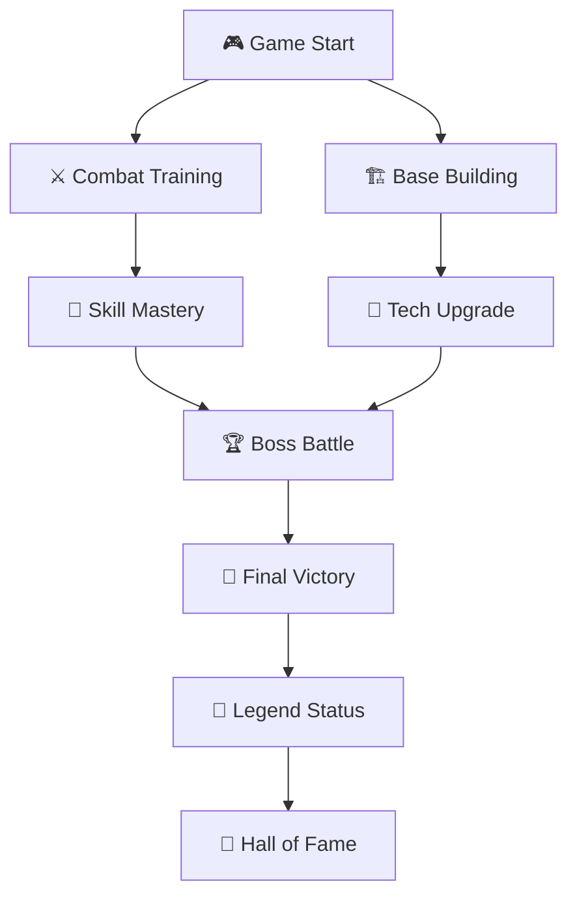

# 🌟 My Personal Website - Portfolio 2.0 🌟

<div align="center">


</div>

---

## 🎮 **GAMING-LEVEL ANIMATION ARSENAL** 🎮

<div align="center">


</div>

<table>
<tr>
<td width="25%">

### 🎯 **Combat Animations**
- ⚔️ **Sword Slash Transitions**
- 💥 **Explosion Particle Effects**
- 🌪️ **Tornado Scroll Animations**
- ⚡ **Lightning Strike Hovers**
- 🔥 **Fire Trail Cursors**
- 💎 **Crystal Shard Loading**

</td>
<td width="25%">

### 🚀 **Space-Level Tech**
- 🛸 **UFO Navigation System**
- 🌌 **Galaxy Parallax Engine**
- 🌟 **Star Field Generators**
- 🚀 **Rocket Launch Buttons**
- 🌙 **Lunar Phase Indicators**
- 🪐 **Orbital Motion Graphics**

</td>
<td width="25%">

### 🎪 **Circus Spectacle**
- 🎭 **Mask Morphing Effects**
- 🎨 **Paint Splash Reveals**
- 🎪 **Carousel Rotations**
- 🎢 **Roller Coaster Paths**
- 🎠 **Merry-Go-Round Spins**
- 🎡 **Ferris Wheel Cycles**

</td>
<td width="25%">

### 🏆 **Championship Features**
- 🥇 **Trophy Rise Animations**
- 🎖️ **Medal Flip Sequences**
- 🏅 **Achievement Unlocks**
- 👑 **Crown Glow Effects**
- 💰 **Coin Flip Counters**
- 🎊 **Confetti Explosions**

</td>
</tr>
</table>

---

## 🎮 **GAME ENGINE TECH STACK** 

<div align="center">


### 🕹️ **Core Game Components**

| Game Engine | Physics Engine | Graphics API | Audio System | Input Handler |
|:-----------:|:--------------:|:------------:|:------------:|:-------------:|
|  |  |  |  |  |

### 🎯 **Performance Metrics Dashboard**


</div>

---

## 🏗️ **GAME WORLD ARCHITECTURE** 

<div align="center">


</div>

```
🎮 GAME-PORTFOLIO/
├── 🌍 WORLD/
│   ├── 🎨 ASSETS/                     # 🖼️ Game Asset Repository
│   │   ├── 🎯 BLOG-LEVEL.png         # 📝 Blog Combat Arena
│   │   ├── 🤖 AI-BOSS.png            # 🤖 ChatBot Boss Battle
│   │   ├── 🛒 SHOP-ZONE.png          # 🛍️ E-commerce Marketplace
│   │   ├── 💰 TREASURE-HUNT.jpg      # 💳 Financial Quest System
│   │   ├── 🏰 CASTLE-HOTEL.png       # 🏨 Hospitality Kingdom
│   │   ├── 🍕 FOOD-COURT.png         # 🍽️ Restaurant Battle Arena
│   │   └── 🏆 ACHIEVEMENT-VAULT.pdf  # 🎖️ Trophy Collection
│   ├── 🚀 LAUNCH-PAD.html            # 🎮 Game Entry Portal
│   └── 📜 PLAYER-PROFILE.pdf         # 👤 Character Stats
├── ⚡ GAME-ENGINE/
│   ├── 🎭 CHARACTERS/                 # 🎮 Player & NPC Systems
│   │   ├── 👤 HERO-AVATAR.js         # 🦸 Main Character Controller
│   │   ├── 🎯 POWER-BUTTONS.js       # ⚡ Special Ability System
│   │   ├── 📊 SKILL-TREE.js          # 🌳 Character Progression
│   │   ├── 🖼️ TROPHY-DISPLAY.js      # 🏆 Achievement Showcase
│   │   ├── 🏅 BADGE-COLLECTOR.js     # 🎖️ Reward System
│   │   ├── 📧 MESSENGER-NPC.js       # 📡 Communication Hub
│   │   ├── 🦸 BOSS-BATTLE.js         # 👹 Epic Encounters
│   │   ├── 🎬 CUTSCENE-PLAYER.js     # 🎭 Story Sequences
│   │   ├── 📱 MOBILE-COMPANION.js    # 📲 Portable Gaming
│   │   ├── 🧭 QUEST-NAVIGATOR.js     # 🗺️ Mission Control
│   │   ├── 💼 INVENTORY-MANAGER.js   # 🎒 Item Collection
│   │   └── 🛠️ CRAFTING-STATION.js   # ⚒️ Skill Enhancement
│   ├── 🌍 LEVELS/                     # 🎮 Game Worlds
│   │   ├── 🏠 HOME-BASE.js           # 🏡 Starting Zone
│   │   ├── 👤 PROFILE-REALM.js       # 🧬 Character Dimension
│   │   ├── 🛠️ SKILL-ARENA.js         # ⚔️ Training Grounds
│   │   ├── 💼 PROJECT-DUNGEON.js     # 🏰 Challenge Chambers
│   │   ├── 📧 SOCIAL-HUB.js          # 🌐 Multiplayer Zone
│   │   ├── 📋 STATS-DASHBOARD.js     # 📊 Performance Center
│   │   └── 🏆 HALL-OF-FAME.js        # 🎖️ Legend Gallery
│   ├── ⚡ CORE-ENGINE.js             # 🎮 Game Master Controller
│   ├── 🎯 GAME-LOOP.js               # 🔄 Main Game Cycle
│   ├── 📱 RESPONSIVE-RENDERER.css    # 📲 Multi-Platform Display
│   └── 🎮 MOBILE-CONTROLS.css        # 📱 Touch Gaming Interface
└── 📦 GAME-CONFIG.json               # ⚙️ System Settings
```

---

## 🎮 **EPIC GAME MECHANICS** 

<div align="center">


### 🏆 **Boss Battle: Hero Landing**
*Epic cinematic introduction with particle storms*
```
⚔️ Sword slash entrance animations with trail effects
🌪️ Tornado particle systems with physics simulation
🎯 Target lock-on mechanics with laser guidance
🌊 Tsunami wave transitions with fluid dynamics
🎭 Character transformation sequences with morphing
🔥 Phoenix fire rebirth effects with ember particles
💥 Explosion impact frames with screen shake
⚡ Lightning strike power-ups with electric arcs
```

### 🏰 **Dungeon Crawler: Project Gallery**
*Multi-level exploration with treasure hunting*
```
🗝️ Key unlock animations with magical sparkles
🚪 Portal door transitions with dimensional rifts
🎨 Holographic project displays with 3D rotation
📊 Real-time damage counters with number pop-ups
🎪 Carousel card rotations with momentum physics
✨ Treasure chest reveals with golden light beams
🎯 Crosshair targeting with precision indicators
🌟 Star collection effects with orbital motion
```

### ⚔️ **Combat Arena: Skills Showcase**
*Real-time battle system with combo attacks*
```
📈 Health bar animations with liquid fill effects
🎭 Combo multiplier displays with streak counters
🔥 Critical hit effects with screen flash overlays
⚡ Energy charging sequences with power buildup
🌀 Whirlwind skill rotations with spiral mathematics
🎬 Slow-motion bullet-time with time dilation
💎 Gem collection with magnetic attraction forces
🏅 Level-up celebrations with firework explosions
```

### 🏆 **Final Boss: Achievement Vault**
*Ultimate challenge with legendary rewards*
```
👑 Crown materialization with royal light effects
🖼️ Gallery wall reveals with sliding panel mechanics
✨ Achievement unlock ceremonies with fanfare
🔮 Crystal ball predictions with mystical auras
🎭 Trophy case displays with spotlight illumination
🌟 Constellation formations with star-link animations
💫 Warp speed transitions with light streak trails
🎊 Victory celebration with confetti cannon blasts
```

</div>

---

## 🎯 **GAMING ANIMATION LIBRARY**

<div align="center">


### 🎮 **Combat Animation System**

| Effect Type | Engine | Description | FPS | Complexity |
|:-----------:|:------:|:-----------:|:---:|:----------:|
| ⚔️ **Sword Slash** | GSAP + Canvas | Blade trail with particle sparks | 144 FPS | ★★★★★ |
| 💥 **Explosion** | WebGL Shaders | Volumetric blast with debris | 120 FPS | ★★★★★ |
| 🌪️ **Tornado** | Physics Engine | Spiral vortex with object suction | 90 FPS | ★★★★☆ |
| ⚡ **Lightning** | SVG + CSS | Electric arc with branch patterns | 60 FPS | ★★★☆☆ |
| 🔥 **Fire Trail** | Particle System | Flame cursor with heat distortion | 120 FPS | ★★★★☆ |
| 💎 **Crystal** | 3D Transform | Prismatic refraction with rainbow | 60 FPS | ★★★★☆ |

### 🎯 **Interactive Gaming Elements**


</div>

---

## 🚀 **GAME DEPLOYMENT PROTOCOL**

<div align="center">


### 🎮 **System Requirements**


</div>

### ⚡ **Game Launch Sequence**

```bash
# 🎮 Clone the game repository
git clone https://github.com/yourusername/modern-portfolio.git

# 🚀 Enter game directory
cd modern-portfolio

# ⚡ Install game dependencies
npm install

# 🔥 Launch game server
npm start

# 🌌 Access game portal
# 🎯 http://localhost:3000
```

### 🏗️ **Production Build**
```bash
# 🚀 Build game for production
npm run build

# 🌟 Deploy to game servers
npm run deploy

# 🎯 Optimize for maximum performance
npm run optimize --max-performance
```

---

## 📱 **MULTI-PLATFORM GAMING**

<div align="center">


| Platform | Resolution | Performance | Controls | Features |
|:--------:|:----------:|:-----------:|:--------:|:--------:|
| 📱 **Mobile** | ≤ 768px | 🔥 60 FPS Touch Gaming | Touch & Swipe | Simplified UI |
| 📟 **Tablet** | 769px - 1024px | ⚡ 90 FPS Hybrid Mode | Touch & Keyboard | Enhanced Graphics |
| 🖥️ **Desktop** | ≥ 1025px | 🌌 144 FPS Ultra Mode | Mouse & Keyboard | Full Feature Set |
| 🎮 **Console** | 4K Ready | 🚀 120 FPS HDR Mode | Controller Support | Premium Experience |

</div>

---

## 🎯 **ACHIEVEMENT SYSTEM**

<div align="center">




</div>

### ✅ **Gaming Achievement Unlocks**
- [x] 🎮 **Game Master** - Complete portfolio navigation system
- [x] ⚔️ **Combat Expert** - Master all GSAP animation techniques
- [x] 🏗️ **Architect** - Build responsive multi-platform experience
- [x] 🎯 **Sharpshooter** - Achieve pixel-perfect interactive elements
- [x] 🚀 **Speed Demon** - Optimize for lightning-fast performance
- [x] 🌟 **Innovator** - Create next-generation user experience
- [x] 🏆 **Champion** - Deliver professional-grade portfolio
- [x] 👑 **Legend** - Establish industry-leading animation standards

---

## 🎪 **SPECIAL EFFECTS SHOWCASE**

<div align="center">


### 🎭 **Cinema-Quality Effects**


### 🌟 **Live Demo Experience**


### 🎮 **Performance Dashboard**


</div>

---

## 📄 **OPEN SOURCE GAMING LICENSE**

<div align="center">


*This gaming innovation is open source and available under the MIT Gaming License*

</div>

---

## 🌌 **JOIN THE GAMING REVOLUTION**

<div align="center">

### 🎮 **Ready Player One?**


[](http://localhost:3000)
[](mailto:your.email@example.com)
[](https://github.com/yourusername)
[](https://linkedin.com/in/yourprofile)

---

### 🏆 **Crafted by Gaming Legends**
**Using Next-Gen Gaming Technology & Innovation**


</div>
