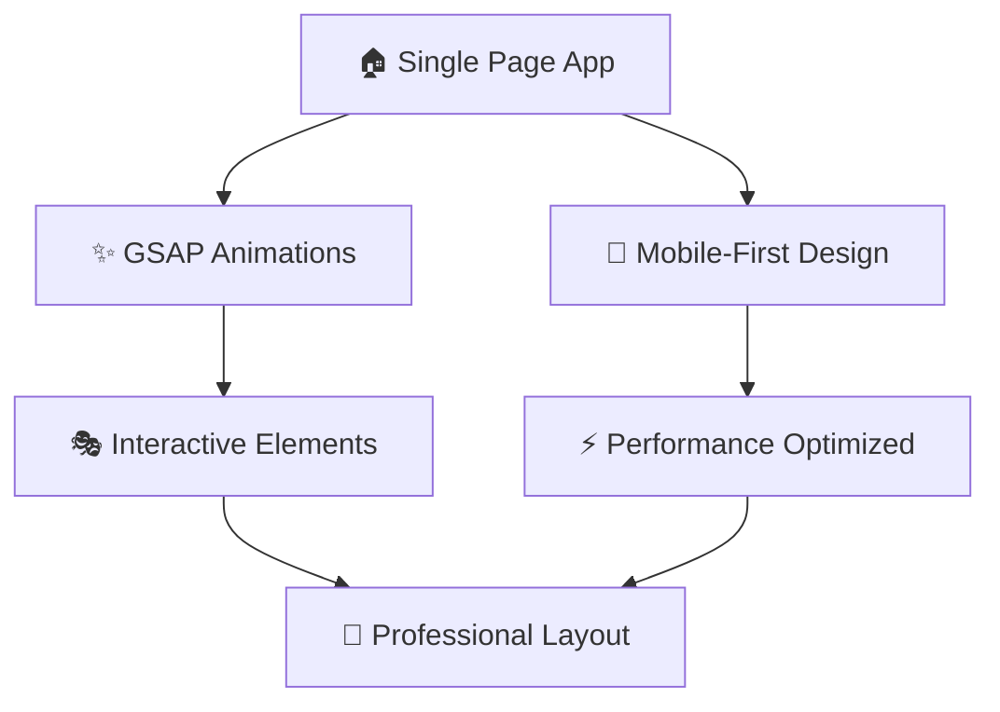

# ✨ My Personal Website - Portfolio 2.0 ✨

<div align="center">


### 🚀 A Modern, Animated Personal Portfolio Website 🚀

*Built with React.js featuring stunning GSAP animations and responsive design*

</div>

---

## 🌟 **FEATURES SHOWCASE** 🌟

<table>
<tr>
<td width="50%">

### 🎨 **Visual Excellence**
- ✨ **Smooth GSAP Animations**
- 🎭 **Interactive Hover Effects** 
- 📱 **Mobile-First Responsive Design**
- 🌈 **Modern UI/UX Components**
- 🎪 **Custom Loading Animations**

</td>
<td width="50%">

### ⚡ **Performance & Navigation**
- 🚀 **Single Page Application**
- 🧭 **React Router Navigation**
- 📊 **Animated Progress Bars**
- 🖼️ **Interactive Project Gallery**
- 📜 **PDF Certificate Viewer**

</td>
</tr>
</table>

---

## 🛠️ **TECH STACK POWERHOUSE** 

<div align="center">

| Frontend | Animation | Styling | Icons | Routing |
|:--------:|:---------:|:-------:|:-----:|:-------:|
|  |  |  |  |  |

</div>

---

## 📁 **PROJECT ARCHITECTURE** 

```
🏗️ modern-portfolio/
├── 📂 public/
│   ├── 🖼️ images/                    # Project screenshots & certificates
│   │   ├── 📸 BLOG.png
│   │   ├── 🤖 ChatBot.png
│   │   ├── 🛒 E commerce.png
│   │   ├── 💰 Expense Tracker.jpg
│   │   ├── 🏨 hotel.png
│   │   ├── 🍽️ restarant.png
│   │   └── 📜 [certificates].pdf     # Professional certificates
│   ├── 📄 index.html
│   └── 📋 Resume.pdf
├── 📂 src/
│   ├── 🧩 components/                # React components
│   │   ├── 👤 About.js              # About section
│   │   ├── 🎯 AnimatedButton.js     # Custom animated buttons
│   │   ├── 🏆 Certifications.js     # Certificate display
│   │   ├── 📧 Contact.js            # Contact form
│   │   ├── 🦸 Hero.js               # Hero/landing section
│   │   ├── 🎬 HuluIntro.js          # Intro animation
│   │   ├── 📱 MobileLoader.js       # Mobile loading screen
│   │   ├── 🧭 Navbar.js             # Navigation bar
│   │   ├── 💼 Projects.js           # Project gallery
│   │   └── 🛠️ Skills.js             # Skills showcase
│   ├── 📄 pages/                    # Page components
│   │   ├── 🏠 Home.js               # Home page
│   │   ├── 👤 AboutPage.js          # About page
│   │   ├── 🛠️ SkillsPage.js         # Skills page
│   │   ├── 💼 ProjectsPage.js       # Projects page
│   │   ├── 📧 ContactPage.js        # Contact page
│   │   ├── 📋 ResumePage.js         # Resume page
│   │   └── 🏆 CertificationsPage.js # Certifications page
│   ├── ⚛️ App.js                    # Main app component
│   ├── 🎯 index.js                  # Entry point
│   ├── 📱 responsive.css            # Responsive styles
│   └── 📲 mobile-enhancements.css   # Mobile-specific styles
└── 📦 package.json
```

---

## 🎨 **COMPONENT SHOWCASE**

<div align="center">

### 🦸‍♂️ **Hero Section**
*Animated introduction with GSAP magic*
```
✨ Professional tagline animations
🎯 Call-to-action buttons with hover effects
🌊 Smooth scroll animations
```

### 💼 **Projects Gallery** 
*Interactive showcase of development work*
```
🖼️ Hover-animated project cards
🔗 Live demo & source code links
🏷️ Technology stack badges
```

### 🛠️ **Skills Section**
*Animated technical expertise display*
```
📊 Animated progress bars
🎭 Interactive hover animations
📂 Categorized skill groups
```

### 🏆 **Certifications**
*Professional achievement viewer*
```
📜 PDF certificate integration
🖼️ Modal-based viewing
✨ Smooth transitions
```

</div>

---

## 🚀 **QUICK START GUIDE**

<div align="center">

### 📋 **Prerequisites**


</div>

### ⚡ **Installation Steps**

```bash
# 1️⃣ Clone the repository
git clone https://github.com/yourusername/modern-portfolio.git

# 2️⃣ Navigate to project
cd modern-portfolio

# 3️⃣ Install dependencies
npm install

# 4️⃣ Start development server
npm start

# 5️⃣ Open in browser
# 🌐 http://localhost:3000
```

### 🏗️ **Build for Production**
```bash
npm run build
```

---

## 📱 **RESPONSIVE BREAKPOINTS**

<div align="center">

| Device | Screen Size | Optimization |
|:------:|:-----------:|:------------:|
| 📱 **Mobile** | ≤ 768px | Touch-optimized UI |
| 📟 **Tablet** | 769px - 1024px | Balanced layout |
| 🖥️ **Desktop** | ≥ 1025px | Full feature set |

</div>

---

## 🎯 **IMPLEMENTED FEATURES**

<div align="center">



</div>

### ✅ **Feature Checklist**
- [x] 🚀 Single Page Application with smooth navigation
- [x] ✨ GSAP-powered animation system
- [x] 📱 Mobile-first responsive design
- [x] 🎭 Interactive hover effects and components
- [x] 🎨 Clean, modern professional layout
- [x] ⚡ Performance optimized for fast loading

---

## 📄 **LICENSE**

<div align="center">


*This project is open source and available under the MIT License*

</div>

---

## 📞 **GET IN TOUCH**

<div align="center">

### 💬 **Let's Connect!**

*Feel free to reach out through the contact form on the website or connect via social media*

---

### 💖 **Built with Love**
**Using React.js and Modern Web Technologies**


</div>
