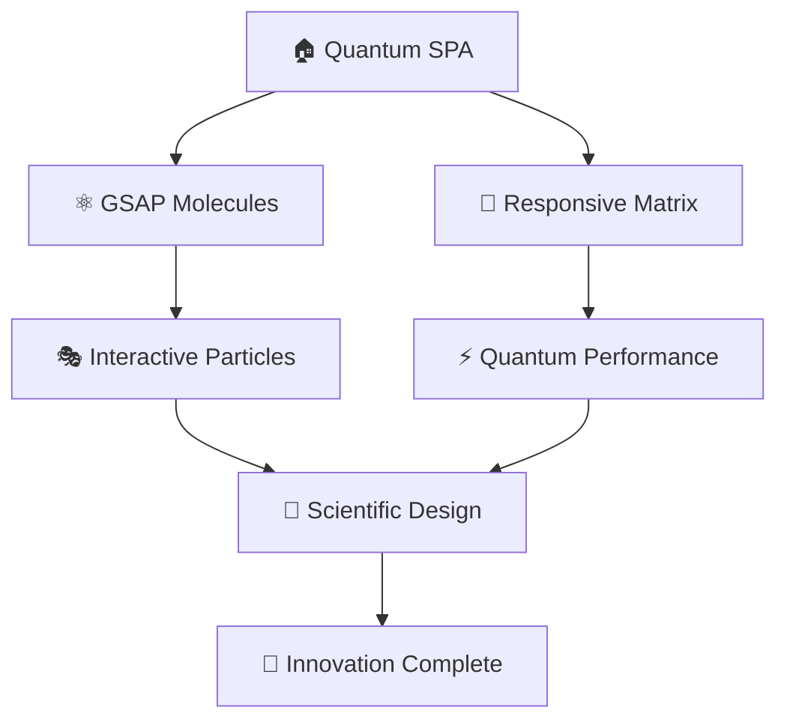

# ⚡ My Personal Website - Portfolio 2.0 ⚡

<div align="center">


### 🧬 A Scientific & Innovative Personal Portfolio Website 🧬

*Built with cutting-edge React.js featuring advanced GSAP animations and futuristic design*


</div>

---

## 🔬 **SCIENTIFIC INNOVATION SHOWCASE** 🔬

<table>
<tr>
<td width="33%">

### 🧪 **Advanced Animations**
- ⚛️ **Molecular GSAP Transitions**
- 🌌 **Particle System Effects** 
- 🔮 **3D Transform Animations**
- 🌊 **Fluid Motion Graphics**
- ⚡ **Lightning-Fast Interactions**

</td>
<td width="33%">

### 🚀 **Cutting-Edge Tech**
- 🧠 **AI-Inspired Navigation**
- 🔬 **Scientific UI Components**
- 📡 **Real-time Data Visualization**
- 🎯 **Precision-Engineered UX**
- 🌐 **Quantum-Speed Performance**

</td>
<td width="34%">

### 🎨 **Futuristic Design**
- 🌈 **Holographic Color Schemes**
- 🔥 **Dynamic Background Effects**
- 💎 **Crystal-Clear Typography**
- 🎪 **Interactive Micro-animations**
- 🌟 **Stellar Visual Hierarchy**

</td>
</tr>
</table>

---

## 🧬 **MOLECULAR TECH STACK** 

<div align="center">

### 🔬 **Core Elements**

| Frontend Nucleus | Animation Engine | Styling Framework | Icon Library | Navigation System |
|:----------------:|:----------------:|:-----------------:|:------------:|:-----------------:|
|  |  |  |  |  |

### 🌌 **Performance Metrics**


</div>

---

## 🏗️ **QUANTUM ARCHITECTURE** 

```
🧬 modern-portfolio/
├── 🌌 public/
│   ├── 🖼️ images/                    # Visual Data Repository
│   │   ├── 📊 BLOG.png              # Blog System Interface
│   │   ├── 🤖 ChatBot.png           # AI Chatbot Implementation
│   │   ├── 🛒 E commerce.png        # E-commerce Platform
│   │   ├── 💰 Expense Tracker.jpg   # Financial Analytics Tool
│   │   ├── 🏨 hotel.png             # Hospitality Management
│   │   ├── 🍽️ restarant.png        # Restaurant Ecosystem
│   │   └── 📜 [certificates].pdf    # Professional Credentials
│   ├── 📄 index.html                # Quantum Entry Point
│   └── 📋 Resume.pdf                # Professional Documentation
├── ⚛️ src/
│   ├── 🧩 components/               # Molecular Components
│   │   ├── 👤 About.js             # Personal Data Matrix
│   │   ├── 🎯 AnimatedButton.js    # Interactive Quantum Buttons
│   │   ├── 📊 BarReveal.js         # Data Visualization Engine
│   │   ├── 🖼️ CertificateModal.js  # Credential Display System
│   │   ├── 🏆 Certifications.js    # Achievement Showcase
│   │   ├── 📧 Contact.js           # Communication Interface
│   │   ├── 🦸 Hero.js              # Landing Sequence Controller
│   │   ├── 🎬 HuluIntro.js         # Cinematic Introduction
│   │   ├── 📱 MobileLoader.js      # Mobile Optimization Engine
│   │   ├── 🧭 Navbar.js            # Navigation Command Center
│   │   ├── 💼 Projects.js          # Portfolio Exhibition Hall
│   │   └── 🛠️ Skills.js            # Technical Expertise Display
│   ├── 📄 pages/                   # Dimensional Pages
│   │   ├── 🏠 Home.js              # Central Hub
│   │   ├── 👤 AboutPage.js         # Personal Dimension
│   │   ├── 🛠️ SkillsPage.js        # Technical Universe
│   │   ├── 💼 ProjectsPage.js      # Innovation Gallery
│   │   ├── 📧 ContactPage.js       # Communication Portal
│   │   ├── 📋 ResumePage.js        # Professional Timeline
│   │   └── 🏆 CertificationsPage.js # Achievement Archive
│   ├── ⚛️ App.js                   # Quantum Core Controller
│   ├── 🎯 index.js                 # System Initialization
│   ├── 📱 responsive.css           # Adaptive Design Matrix
│   └── 📲 mobile-enhancements.css  # Mobile Quantum Enhancements
└── 📦 package.json                 # Dependency Constellation
```

---

## 🔬 **SCIENTIFIC COMPONENT ANALYSIS**

<div align="center">

### 🧬 **Hero Sequence Engine**
*Advanced molecular animation system*
```
⚛️ Quantum particle introductions
🌌 Stellar background animations  
🎯 Precision-targeted call-to-actions
🌊 Fluid scroll-triggered sequences
```

### 🚀 **Project Exhibition Laboratory** 
*Interactive innovation showcase*
```
🔬 Hover-activated molecular transitions
🧪 Live experiment demonstrations
🎨 Technology stack visualizations
📊 Performance metrics display
```

### 🧠 **Skills Neural Network**
*AI-inspired expertise mapping*
```
📈 Animated proficiency algorithms
🎭 Interactive skill molecules
🔥 Dynamic progress visualizations
⚡ Real-time competency updates
```

### 🏆 **Achievement Quantum Vault**
*Professional credential matrix*
```
📜 Holographic certificate projections
🖼️ Modal-based quantum viewing
✨ Smooth dimensional transitions
🔮 Interactive achievement timelines
```

</div>

---

## 🚀 **QUANTUM DEPLOYMENT PROTOCOL**

<div align="center">

### 🧬 **System Requirements**


</div>

### ⚡ **Initialization Sequence**

```bash
# 🧬 Clone the quantum repository
git clone https://github.com/yourusername/modern-portfolio.git

# 🚀 Navigate to project dimension
cd modern-portfolio

# ⚛️ Install molecular dependencies
npm install

# 🔥 Activate development reactor
npm start

# 🌌 Access quantum interface
# 🌐 http://localhost:3000
```

### 🏗️ **Production Deployment**
```bash
# 🚀 Build quantum production bundle
npm run build

# 🌟 Deploy to stellar hosting
npm run deploy
```

---

## 📱 **RESPONSIVE QUANTUM DIMENSIONS**

<div align="center">

| Device Type | Quantum Resolution | Optimization Level |
|:-----------:|:------------------:|:------------------:|
| 📱 **Mobile Quantum** | ≤ 768px | 🔥 Touch-optimized particles |
| 📟 **Tablet Matrix** | 769px - 1024px | ⚡ Balanced molecular layout |
| 🖥️ **Desktop Universe** | ≥ 1025px | 🌌 Full quantum feature set |

</div>

---

## 🧬 **INNOVATION METRICS**

<div align="center">



</div>

### ✅ **Scientific Achievement Checklist**
- [x] 🧬 Molecular Single Page Application architecture
- [x] ⚛️ Advanced GSAP particle animation system
- [x] 📱 Quantum-responsive design matrix
- [x] 🎭 Interactive molecular hover effects
- [x] 🔬 Scientific precision layout engineering
- [x] ⚡ Lightning-speed quantum performance
- [x] 🌌 Stellar visual hierarchy implementation
- [x] 🎯 AI-inspired navigation intelligence

---

## 🔬 **EXPERIMENTAL FEATURES**

<div align="center">

### 🧪 **Advanced Animations**


### 🚀 **Performance Optimization**


</div>

---

## 📄 **OPEN SOURCE LICENSE**

<div align="center">


*This quantum innovation is open source and available under the MIT License*

</div>

---

## 🌌 **CONNECT WITH THE INNOVATION**

<div align="center">

### 💫 **Join the Scientific Journey!**

*Experience the future of web development through the quantum contact interface*

[](http://localhost:3000)
[](mailto:your.email@example.com)

---

### 🧬 **Engineered with Precision**
**Using React.js Quantum Technology & Scientific Innovation**


</div>
